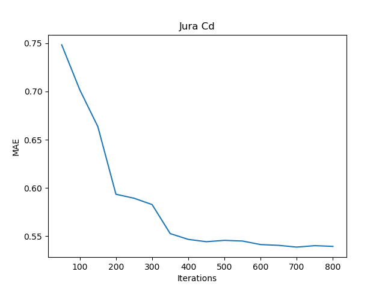

# Near-Optimal Active Learning of Multi-Output Gaussian Processes

## Installation
This is the implementation of **Near-Optimal Active Learning of Multi-Output Gaussian Processes** paper (https://arxiv.org/abs/1511.06891). This repository uses the Intrinsic Coregionalization Model (ICM) instead of Convolved MOGP model used in the paper. 

### Requirements: 
* [GPyTorch](https://github.com/cornellius-gp/gpytorch) (Beta Release)
* [PyTorch](https://pytorch.org/)
* [Pandas](https://pandas.pydata.org/)

After installing the listed dependencies, simply clone this package to run scripts.

## Getting Started
See `run.py` script to setup the Jura dataset used in the paper and perform active learning with MOGP. You can setup certain arguments from command line. Simply execute the following to start the training. 
```
python run.py
```

## Results
The plot of MAE (Mean absolute error) of model's prediction of Cd concentration on the test set against the number of training samples is shown below:



## Contact
For any queries, feel free to raise an issue or contact me at sumitsk@cmu.edu.

## License
This project is licensed under the MIT License - see the [LICENSE.md](LICENSE.md) file for details.
